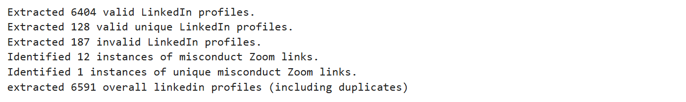

# 🚨 LinkedIn Misconduct Detection from Chat Data

## 🧠 Objective
To detect potentially suspicious behavior in shared LinkedIn profiles and Zoom links found within chat transcripts using Python. The project flags:
- Malformed or suspicious LinkedIn URLs
- Zoom links shared in inappropriate contexts (indicative of misconduct)
- Duplicate and valid LinkedIn profiles

---

## 📦 Tools Used
- Python
- `os` – Folder traversal
- `re` – Regular expressions for URL detection
- `set()` – Duplicate detection
- File I/O – Exporting results to `.txt`

---

## 🗃️ Project Workflow

### 🔹 Step 1: Merge Chat Logs
The `code.ipynb` script:
- Loops through multiple subfolders containing `.txt` chat logs
- Merges them into one file: `merged_chat_data.txt`

### 🔹 Step 2: Detect and Classify URLs
The `code.ipynb` script:
- Scans for:
  - ✅ Valid LinkedIn profiles
  - ❌ Invalid LinkedIn links
  - 🚨 Zoom links (considered misconduct in your context)
- Saves outputs into 5 result files

---

## 🔍 Regex Logic Used

| Purpose                     | Pattern Used                                      |
|----------------------------|---------------------------------------------------|
| LinkedIn Profile Detection | `linkedin.com/in/[a-zA-Z0-9-]+`                   |
| URL Catch-All              | Generic URL detection across multiple domains     |
| Misconduct (Zoom Links)    | `zoom\.us/j/[0-9]+`                               |

---

## 📁 Output Files (inside `/output`)

- `valid_linkedin_profiles.txt`
- `valid_unique_linkedin_profiles.txt`
- `invalid_linkedin_profiles.txt`
- `misconduct_zoom_links.txt`
- `unique_misconduct_zoom_links.txt`

📷 Screenshot:  


---

## 🚀 How to Run the Project

```bash
# Step 1: Merge Chat Logs
python src/code.ipynb

# Step 2: Run Misconduct Detection
python src/code.ipynb
```

## 🔗 Connect
- GitHub: [github.com/yourusername](https://github.com/Abhiram4u)
- LinkedIn: [linkedin.com/in/YOURNAME](https://www.linkedin.com/in/abhiram06o9)
